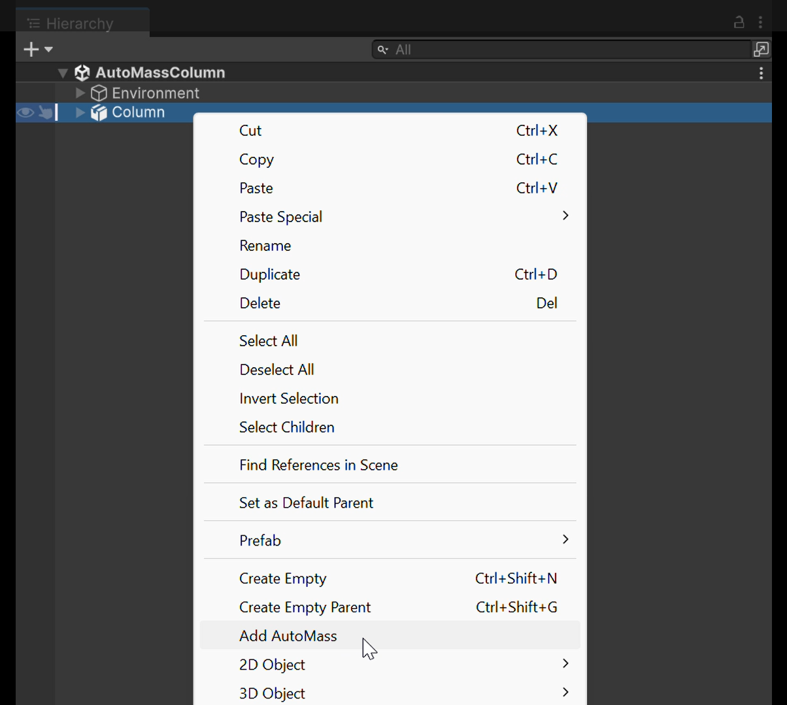
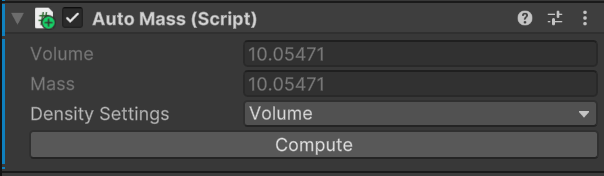
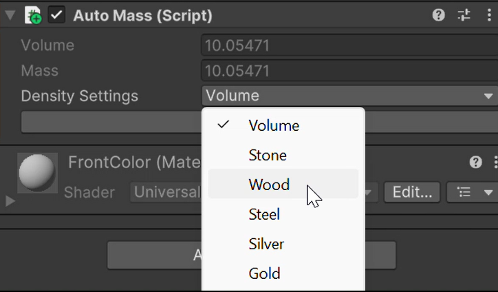
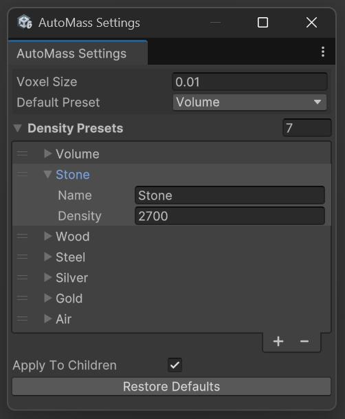
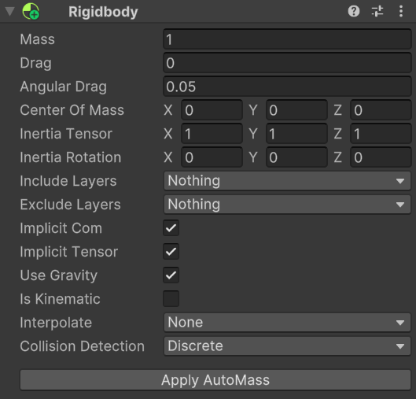

# AutoMass for Unity
Automatically calculate the mass of GameObjects in Unity based on volume and density.

---

## 📦 Features
- Right-click any GameObject in the hierarchy to quickly **add an AutoMass component**.
- Supports **density presets** (Stone, Wood, Gold, etc.) or **custom densities**.
- Adjustable **voxel size** for volume precision.
- Customizable **density presets** via the Settings window.
- Adds an **"Apply AutoMass"** button to Rigidbody inspectors that aggregates child masses automatically.

---

## 🧩 How It Works

1. **Right-click** a GameObject in the **Hierarchy**  
   → Select `Add AutoMass`

   

   You can also select multiple Gameobjects at once

2. The `AutoMass` component will appear on the selected GameObject.
   
   

   Press `Compute` to recompute the volume and the mass at any time applying the current settings.
   
   Choose a **preset material** or enter a **custom density** (kg/m³).

   

3. Open **AutoMass Settings** to modify presets or voxel resolution.

   Open `Window > AutoMass > Settings` to open the settings window

   

   Smaller voxelsizes increase the precision.
   if `ApplyToChildren` is active, `Add AutoMass` will add an `AutoMass` component to all the renderers in the selected gameobjects' children.

4. On any GameObject with a `Rigidbody`, click **"Apply AutoMass"** at the bottom of the Rigidbody inspector.  
   → The mass of all child AutoMass components will be summed and applied.

   

---

## 📌 Notes
- Volume is estimated using voxelization of the object's mesh.
- Best suited for watertight meshes without holes.
- Comming soon:
a new version is currently in review. It includes bug fixes concerning a bug leading to compile errors when building the project.
The new version will be released in the next few days.

---

## 🛠 Installation
1. Import the `.unitypackage` into your project.
2. You’re ready to go! Right-click an object in the Hierarchy to begin.

---

## 🧪 Compatibility
- Unity 2020.3 and above
- Works in Standard, Universal and High Definition pipeline
- No third-party dependencies

---

## 📮 Support
For questions, feature requests, or bug reports:  
📧 v.roller.uni@gmail.com  

---

